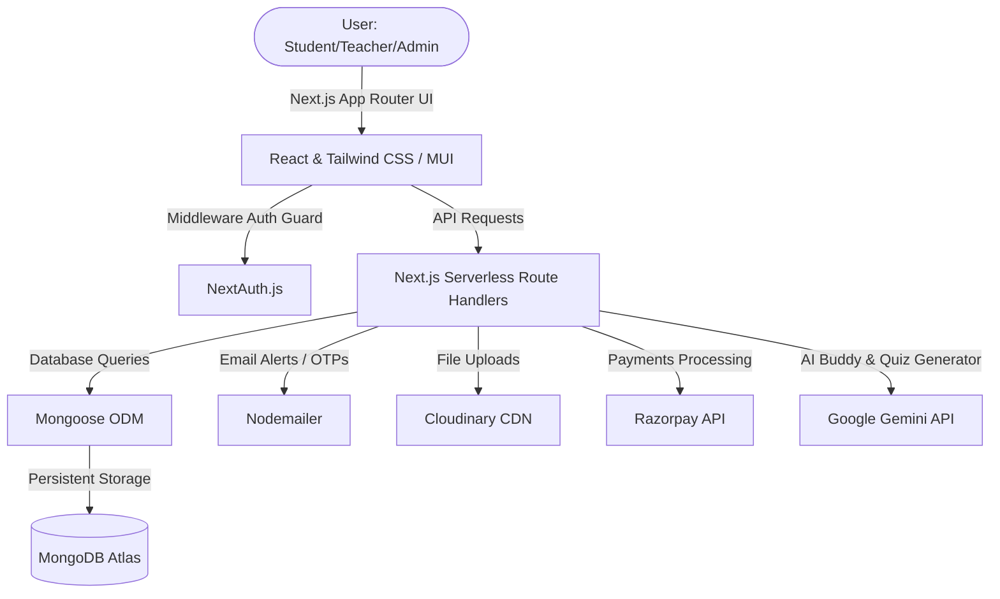

# 🚀 TuitionEd — Expert K-12 Online Tutoring & AI Learning Platform

Welcome to **TuitionEd**, a premium, dark-themed, and highly interactive online/hybrid tutoring ecosystem designed to empower K-12 students, coordinate elite educators, and streamline administrative management. Powered by Next.js, MongoDB, and Gemini AI, TuitionEd merges customized learning, dynamic live class tracking, seamless payments, and cutting-edge artificial intelligence into a modern, gamified web experience.

---

## 🌟 Product Vision & Purpose
TuitionEd was built with a clear purpose: **to make personalized education engaging, seamless, and organized for everyone involved.**

Traditional tuition systems suffer from fragmented tools—parents use one app to pay, teachers use another to share homework, and students attend classes somewhere else entirely. TuitionEd consolidates this fragmented journey:
- **Students** experience a gamified learning portal with an AI-powered quiz generator and a cheerful companion chatbot.
- **Teachers** get a dedicated workplace to claim trial sessions, track their active student base, log earnings, and deliver feedback.
- **Parents** receive automatic consistency reports, direct lesson tracking, and instant payment portals to support their child's academic growth.
- **Administrators** control a unified command center to approve credentials, build courses, deploy newsletters, and audit financial transactions.

---

## 👥 Core Features by User Persona

### 🧑‍🎓 1. The Student Experience
*   **Academic Dashboard:** A central panel showcasing enrolled active courses, class timings, assigned mentors, and session links.
*   **Virtual Classroom Access:** Direct, secure access to dynamic online learning links (`Join Class` and `Visit Classroom`) that activate dynamically according to class schedules.
*   **Free Trial Booking:** A simple booking system for K-12 students or parents to schedule complimentary trial classes for preferred subjects.
*   **Consistency Tracker & Calendar:** A beautiful visual calendar showing completed classes, helping students build study habits and allowing parents to audit academic attendance.
*   **Razorpay Integration:** A seamless checkout flow to buy additional class credits or pay outstanding tuition balances instantly.
*   **Course Messages & Chats:** Direct messaging within each course, enabling students to communicate with teachers and share files (like completed assignments) safely.

### 👩‍🏫 2. The Teacher Workspace
*   **Professional Onboarding:** A structured application form where educators submit qualifications, teaching experience, subject checklists, and a PDF CV (handled via Cloudinary).
*   **Teacher Dashboard:** Real-time business metrics tracking **Active Students**, **Total Earnings ($/₹)**, **Total Teaching Hours**, and **Completed Sessions**.
*   **Demo Class Claiming System:** An open board showing pending demo requests. Teachers can claim classes matching their qualifications and schedule them instantly.
*   **Session Logger & Homework Portal:** Teachers mark classes as complete, specifying the topic covered, duration, and detailed homework instructions, along with homework attachments.
*   **Student Hub:** Quick access to contact cards, schedules, and active chat threads for all assigned students.

### 🔑 3. The Administrator Command Center
*   **Admin Dashboard:** High-level metrics tracking financial earnings, active course enrollment, registered user growth, and pending actions.
*   **Teacher Approval Workflows:** A manual review board where admins inspect teacher applications, verify CVs, and approve/reject profiles to maintain high academic standards.
*   **Course Builder & Assignment:** A system for creating courses, defining grade-level curriculum, scheduling days, assigning teachers, and setting custom per-class tuition fees.
*   **Bulk Communication (Email Blast):** Send rich HTML emails directly to all students, teachers, or custom segments for holiday schedules, general announcements, or system alerts.
*   **Transaction Audit Log:** Full visibility into payment records, transaction IDs, amounts, and payment statuses (completed, pending, failed).

---

## 🧠 AI-Powered Learning Suite

TuitionEd integrates advanced Large Language Models via the **Google Gemini API** to provide an educational safety net and gamified testing suite.

### 🤖 1. "Ed" — Your AI Learning Buddy
*Ed* is a highly engaging, custom-prompted AI tutor located right in the sidebar. 
*   **Personality:** Super cheerful, cartoonish, encouraging, and rich in emojis (✨, 🚀, 🧠). Ed refers to the user as "friend" or "smarty-pants."
*   **Context-Aware:** Ed has a built-in guide of TuitionEd. It helps students find classroom links, guides parents through account creation, and troubleshoots dashboard features.
*   **Safety Filter:** If asked about non-educational/grown-up topics, Ed giggles and politely steers the conversation back to school subjects and active courses.

### 📝 2. AI Academic Assessment (Dynamic Quiz Generator)
Located in `/student/test`, this interactive gaming-style exam center lets students test themselves on *any* topic in real time.
*   **On-Demand Question Generation:** The student inputs a topic (e.g., *Quantum Physics*, *Ancient Rome*, *Algebra*), selects their Grade Level (1 to 12), and chooses the question count (5, 10, or 15).
*   **Structured Schema Enforcement:** The backend enforces a strict JSON-mode response from Gemini, ensuring error-free generation of multiple-choice questions, options, and correct answers.
*   **Interactive Testing Interface:** Beautiful custom-designed Radio components built with Tailwind & Material UI.
*   **Gamified Report Card:** Shows an instant score, a motivational rating (e.g., *Perfect Score!* or *Keep Practicing!*), and a detailed breakdown of correct vs. incorrect answers.

---

## 🛠️ System Architecture & Tech Stack

TuitionEd is structured as a full-stack, enterprise-grade Next.js application:



### Technical Blueprint
*   **Framework:** Next.js (version 16.1.6 with React 18, App Router)
*   **Language:** TypeScript
*   **Database:** MongoDB via Mongoose ODM
*   **Authentication:** NextAuth.js (supporting OTP-based custom credentials & Google OAuth)
*   **Aesthetics & Style:** Tailwind CSS v4, Material UI (MUI v7), and `@emotion` styles
*   **Animations:** GSAP & Motion (for buttery smooth transitions, ripple buttons, card spotlight hover effects, and premium feel)
*   **Payment Processor:** Razorpay
*   **Storage Cloud:** Cloudinary (secure storage for CVs, homework files, and profile images)
*   **Mailer System:** Nodemailer (sending transactional emails)

---

## 🗄️ Database Models Map (Mongoose)

TuitionEd organizes relational structures inside MongoDB through strict Mongoose schemas:

### 1. `User` Schema
Tracks accounts, authentication states, and role-specific details.
*   **Basic Info:** `fullName`, `email`, `mobile`, `dateOfBirth`, `address`, `profileImage`
*   **Authentication:** `role` (`student`, `teacher`, `admin`), `provider` (`google`, `credentials`), `otp`, `otpExpires`, `isVerified`
*   **Teacher-specific:** `qualification`, `experiance`, `listOfSubjects`, `aboutTeacher`, `cvUrl`, `joinLink`, `teacherStatus` (`pending`, `approved`, `rejected`)
*   **Student-specific:** `studentStatus` (`pending`, `approved`, `rejected`), `isAcceptingMessages`

### 2. `Course` Schema
Tracks active educational agreements between students and teachers.
*   **Structure:** `title`, `description`, `grade`
*   **Scheduling:** `classTime`, `classDays` (e.g., `["Monday", "Wednesday"]`)
*   **Metrics:** `noOfClasses` (purchased), `noOfclassTeacher` (completed classes count)
*   **Financials:** `perClassPrice` (charged to student), `teacherPerClassPrice` (paid to teacher), `paymentStatus` (`pending`, `completed`, `failed`)
*   **Relationships:** `studentId` (Ref User), `teacherId` (Ref User)
*   **Portals:** `joinLink` (Zoom/Teams), `classroomLink` (Google Classroom)

### 3. `DemoClass` Schema
Manages complimentary trial session workflows.
*   **Details:** `subject`, `topic`, `grade`, `bookingDateAndTime`, `timeZone`
*   **Location Context:** `city`, `country`, `fatherName` (parent details)
*   **Status:** `status` (`pending`, `confirmed`, `completed`, `cancelled`)
*   **Assignments:** `studentId` (Ref User), `teacherId` (Ref User), `joinLink`

### 4. `CompletedClass` Schema
Represents audited classroom logs and homework records.
*   **Identity:** `courseId` (Ref Course), `teacherId` (Ref User), `studentId` (Ref User)
*   **Academics:** `topic`, `duration` (minutes), `homeworkAssigned`, `homeworkFile` (Cloudinary URL)
*   **Timeline:** `completedAt` (timestamps consistency tracker)

### 5. `Transaction` Schema
Audits payment gateway receipts.
*   **Identifiers:** `userId` (Ref User), `courseId` (Ref Course), `transactionId` (Razorpay Unique ID)
*   **Metrics:** `amount`, `numberOfClasses`, `currency`, `paymentStatus` (`pending`, `completed`, `failed`), `paymentGateway` (`razorpay`)

### 6. `CourseMessage` Schema
Powers course-specific chatrooms.
*   **Properties:** `courseId` (Ref Course), `senderId` (Ref User), `message`
*   **Media Support:** `attachmentUrl`, `attachmentType`
*   **Auto-Expiry:** `expires: '30d'` (Automatically deletes old chat histories to conserve DB storage)

---

## 🛤️ Core API Routes Reference

TuitionEd protects sensitive APIs via Next.js Middleware checking role JWT claims.

| Endpoint | Method | Role | Description |
| :--- | :--- | :--- | :--- |
| **`/api/auth/`** | `POST` | Public | Auth handler (Credentials, Google, OTP Verification) |
| **`/api/chatbot`** | `POST` | Student | Chat interaction with AI companion "Ed" |
| **`/api/ai-test`** | `POST` | Student | Structured quiz generator (Gemini JSON mode) |
| **`/api/demoClass`** | `POST`/`GET` | Student | Book or fetch trial classes |
| **`/api/student-profile`** | `GET`/`PUT` | Student | Read or update profile options |
| **`/api/student-courses`** | `GET` | Student | Fetch enrolled active/pending courses |
| **`/api/classCompleted`** | `POST` | Teacher | Log completed sessions and upload homework files |
| **`/api/demo-classes-assign`**| `PUT` | Teacher | Claim a student trial class from the open board |
| **`/api/teacher-dashboard`** | `GET` | Teacher | Fetch analytics (earnings, hours, active student counts) |
| **`/api/approve-teacher`** | `PUT` | Admin | Review and approve/reject credentials |
| **`/api/bulk-email`** | `POST` | Admin | Disseminate HTML newsletter to targeted cohorts |
| **`/api/course`** | `POST`/`PUT`/`DELETE`| Admin | CRUD operations for active courses and fees |

---

## 🔒 Environment Setup (`.env`)

Create a `.env` or `.env.local` file in the root directory. Configure the following keys before launching:

```env
# MongoDB Connection URI
MONGODB_URI="mongodb+srv://<username>:<password>@cluster.mongodb.net/<dbname>"

# Auth Security Secrets
NEXTAUTH_SECRET="your_nextauth_jwt_secret"
JWT_SECRET="your_custom_jwt_secret"

# Transactional Email Server (Nodemailer SMTP)
EMAIL_USER="social@tuition-ed.com"
EMAIL_PASS="your_secure_smtp_password"

# Razorpay Gateways
RP_KEY_ID="rzp_live_your_live_key"
RP_KEY_SECRET="your_live_secret_key"
NEXT_PUBLIC_RP_KEY_ID="rzp_live_your_live_key"

# Cloudinary Storage CDN
CLOUDINARY_CLOUD_NAME="your_cloudinary_cloud_name"
CLOUDINARY_API_KEY="your_api_key"
CLOUDINARY_API_SECRET="your_api_secret"
NEXT_PUBLIC_CLOUDINARY_UPLOAD_PRESET="your_upload_preset_tag"

# Application Base URL
NEXT_PUBLIC_BASE_URL="http://localhost:3000/"

# Google Gemini API Credentials
NEXT_PUBLIC_GOOGLE_API_KEY="AIzaSyYourGeminiApiKey"

# NextAuth Google Auth Provider Credentials
NEXT_PUBLIC_GOOGLE_CLIENT_ID="your_google_client_id.apps.googleusercontent.com"
NEXT_PUBLIC_GOOGLE_CLIENT_SECRET="GOCSPX-your_google_client_secret"
```

---

## 🚀 Installation & Local Development

Follow these steps to run TuitionEd on your local environment:

### Prerequisites
Make sure you have [Node.js](https://nodejs.org) (v18+ recommended) and `npm` installed.

### 1. Clone & Install Dependencies
Navigate to the project root and install all modules:
```bash
npm install
```

### 2. Run the Development Server
Launch the development server:
```bash
npm run dev
```
Open [http://localhost:3000](http://localhost:3000) in your browser to inspect the application.

### 3. Build for Production
To bundle the application for production, compile the code:
```bash
npm run build
```

And run the optimized server:
```bash
npm start
```

---

## ✨ Design & Visual Polish

TuitionEd is built to **wow** at first sight. It incorporates best-in-class modern web design standards:
- **Neon Dark Aesthetics:** Sleek dark-blue/cyan backgrounds (`bg-slate-950`) combined with glowing borders, harmony-tailored colors, and premium glassmorphic overlays.
- **Spotlight Cards:** Custom `SpotlightCard` components that dynamically track the user's cursor, illuminating borders with subtle radial gradients to create depth.
- **Micro-Animations:** Fluid, tactile hover effects on cards, ripple buttons, and custom radio inputs via Motion and GSAP.
- **Custom Fonts:** Fully optimized Vercel Geist and Outfit modern typography to ensure extreme readability and premium feel.

---

*Begin your academic adventure with us at **TuitionEd**, where each step leads to personal and academic growth!* 🎉
